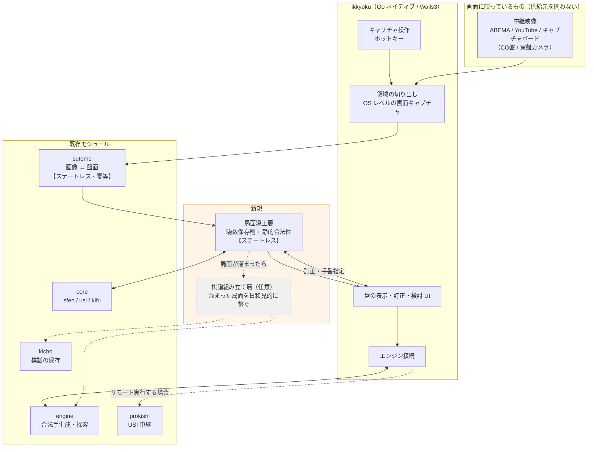
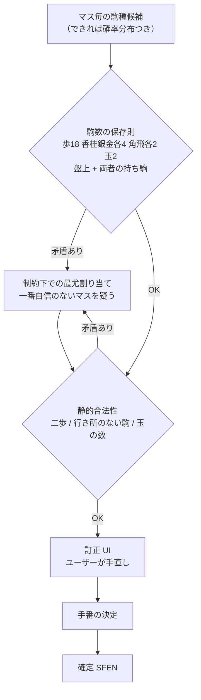
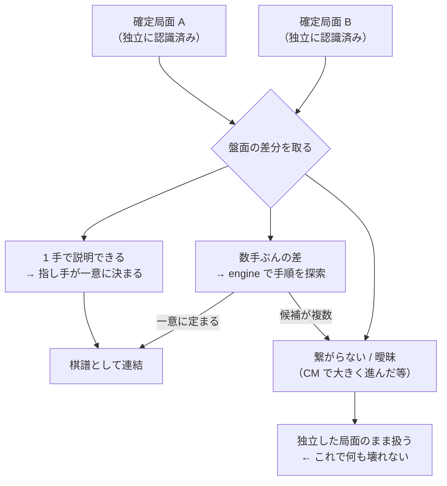
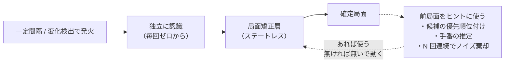

# TODO — 中継観戦アシスタント構想

オンライン中継されている将棋の画面から盤面を割り出し、エンジンで解析して、
**「次善手を選んだらどうなるか」を対話的に辿れる**ようにする構想のメモ。

## Phase 0 の検証結果（2026-08-04 / ABEMA 将棋中継）

**検証済み。入口はネイティブアプリで確定。**

Chrome 拡張（MV3）で 4 経路を診断した結果:

| 経路 | 結果 |
|---|---|
| 通信の傍受（WebSocket / fetch / XHR） | **不可**。中継系は盤面データを流していない（映像に焼き込んで配信） |
| DOM / Canvas の走査 | **不可**。同上 |
| `<video>` → canvas の `drawImage` | **不可**。真っ黒（Widevine DRM） |
| `chrome.tabs.captureVisibleTab` | **不可**。同上 |
| **OS レベルの画面キャプチャ（Win+Shift+S）** | **可**。盤面が普通に写る |

Widevine L3 の保護は **Chrome 自身のキャプチャ API に対しては効くが、OS の画面キャプチャは
素通りする**。したがって **Chrome 拡張という入口自体が不適**だった。

### この結果による設計変更

**入口を Chrome 拡張から Go のネイティブアプリ（`ikkyoku`）に変更する。**
単なる回避策ではなく、素直に上位互換。

- **DRM に関係なく動く。放送局ごとのアダプタが要らない。**
  ABEMA でも YouTube でもキャプチャボードでも、画面に映ってさえいれば同じ経路
- **Go で書けるので `core` / `engine` / `suteme` を直接 import できる。**
  WASM も gRPC-web も不要。Phase 4 の「prokishi のブラウザ向けプロトコル選定」が丸ごと消えた
- **MV3 の制約が全部消える**（service worker の寿命・offscreen document・CSP・MAIN world）
- **UI は Wails3 で作れる。** kicho / prokishi-server で 2 つ動いていて、`wails3` スキルもある
- 失うのは「DOM / 通信から盤面を取る」経路だが、**中継系がデータを流していない以上
  最初から無かった**ので、実質的な損失はない

検証に使った Chrome 拡張のコードは役目を終えたので削除した
（この表が検証結果の記録であり、コードを残す必要はない）。

---

以下、構想全体のメモ。

## 前提（設計判断の土台）

### どの層も履歴に依存しない（最重要）

**履歴は「あれば精度が上がるヒント」であって「動作条件」ではない。**

これを外すと「最初から観戦していないと動かない」「CM 中に盤面が進んだら迷子になる」
という致命的な欠陥が出る。原則を守れば**迷子という状態自体が存在しない**。
失う状態を持っていないため。CM 明けに 5 手進んでいても、それは単に
「新しい局面が 1 つある」というだけのこと。

層の責務は次のように切る。

| 層 | 責務 | 状態 |
|---|---|---|
| `suteme` | 画像 → 盤面（駒配置 + 持ち駒）**のみ** | **ステートレス・冪等** |
| 局面矯正層 | 駒数保存則・静的合法性による検証と矯正 | **ステートレス** |
| 棋譜組み立て層 | 溜まった局面を**日和見的に**繋ぐ | 状態を持つ（が、任意） |

- **suteme は棋譜の仕組みを持たない。** 手番も手数も指し手も知らない。
  同じ画像を渡せば常に同じ盤面を返す。ここを混ぜないこと
- スタック全体が段階的に劣化する。**最悪でも「この 1 局面を解析する」は必ず成立し、
  それが基本機能**。棋譜が取れるのはおまけ

### 個人利用の範囲

不特定多数への配布・SaaS 化は当面考えない。これにより以下が単純化される。

- エンジンの多重化・スケールを考えなくてよい（1 セッション 1 プロセスで足りる）
- Native Messaging によるローカルエンジンが選択肢に入る
- 放送映像のキャプチャと生成物の扱いは、ローカル完結なら懸念が小さい
  （棋譜自体に著作権は及ばないという通説はあるが、放送映像は別の話。
  公開する段になったら線を引き直すこと）

### スナップショット方式が基本、リアルタイムはオプション

**多くの放送は盤面を映し続けない。** 解説者、検討盤面、寄り、カメラ切り替え。
リアルタイム追従にすると、その大半が異常系の処理になってぐしゃぐしゃになる。

→ **ユーザーが任意のタイミングでキャプチャし、その 1 局面を解析する**のを基本形にする。
盤面だけを映し続ける放送に限り、リアルタイムモードを上に載せる。

この判断の効果:

| | リアルタイム基本 | **スナップショット基本** |
|---|---|---|
| 「今、盤面が映っているか」の判定 | 分類器が必要 | **人間がやる（無料）** |
| キャプチャ | offscreen でストリーム | `chrome.tabs.captureVisibleTab` |
| 変化検出・遮蔽・カメラ切替追従 | 全部必要 | **不要** |
| 認識ミスの訂正 | 非現実的 | **UI で手直しできる** |
| 認識精度の要求 | 正しくあれ | **惜しいところまで行け** |
| 前局面からの 1 手到達性フィルタ | 使える | **使えない**（駒数保存則で代替） |
| 手番 | 前局面があれば推定できる | **取れない**（要対策） |
| 解説の変化図 | 弾くべき異常系 | **そのまま機能になる** |
| エンジン | ライブ用 + 検討用の 2 系統 | **1 系統で足りる** |

## 構想図

**実線が基本機能、破線が任意。** 破線側が全く動かなくても
「撮った 1 局面を解析する」は成立する。

Phase 0 の結果、盤面の取得経路は**画面キャプチャの一本**になった
（通信・DOM 経路は中継系に存在しない）。代わりに **`SourceAdapter` による
供給元の抽象化が不要**になり、放送局ごとのアダプタも要らなくなった。
Go なので `engine` を直接呼べる。`prokishi` はリモート実行したくなった場合のみ。

## 局面矯正層（スナップショット方式の肝）

単一フレームには「直前局面から 1 手で到達可能か」という強力なフィルタが使えない。
代わりに**駒数の保存則**を使う。これが単発局面では最強の制約。

- 認識器が確率分布を出せるなら、「歩が 19 枚ある」から**一番自信のないマスを特定して直せる**
- 最後に必ず訂正 UI を通す。ここがあるので認識器は完璧でなくてよい
- **手番は局面からは決まらない**（手数が分からないので導出もできない）。別途 UI か画面から取る

## 棋譜組み立て層（任意・依存先にしないこと）

独立に認識された局面が複数溜まったとき、**繋がるなら繋ぐ**層。
繋がらなければ「独立した局面が 2 つある」で終わり。下の層は平常運転。

- 1〜2 手の差なら差分からほぼ一意に決まる。CM 明けの数手も engine で繋げられる可能性はある
- **これはボーナス機能。絶対に依存先にしない。**
  「最初から観戦していないと動かない」「CM を挟むと迷子になる」の再来を招く
- 繋がった棋譜は kicho に保存できる

## リアルタイムモード（盤面固定の放送のみ・後回し）

盤面を映し続ける放送に限り、**スナップショットを自動で繰り返す**。
「追跡」ではない点が重要。

- **前局面は候補の優先順位付けに使うだけで、いつでも捨てられる。**
  再同期は特別な復帰処理ではなく、常に通っている通常経路
- したがって「盤面が映っていない区間」も特別扱いしない。認識できなければ確定局面が
  増えないだけで、映り始めたら普通に認識が通る
- このモードでは手番の推定精度が上がる（スナップショット方式の穴が部分的に埋まる）が、
  **推定できなくても UI トグルで動く**
- このモードのときだけ、ライブ局面ポインタと検討ツリーが競合するのでエンジンが 2 系統要る

---

## TODO

### Phase 0: 検証 — **完了（2026-08-04）**

結果は冒頭の「Phase 0 の検証結果」を参照。**OS レベルの画面キャプチャ一本で行く**と確定した。

- [x] 対象サイトを決める（ABEMA 将棋中継）
- [x] 盤面情報が通信に流れていないか確認 → **流れていない**
- [x] 盤面が DOM / Canvas で描かれていないか確認 → **描かれていない**
- [x] ブラウザ内でのキャプチャを試す → **DRM で真っ黒**
- [x] OS レベルの画面キャプチャを試す → **取れる**
- [ ] 手番の情報が画面上に取れるか確認する（手番表示・持ち時間のハイライト等）
      ← キャプチャ画像から読む形になるので Phase 2 の一部として持ち越し

### Phase 1: 取り込み層（`ikkyoku` / Go ネイティブ）

`SourceAdapter` は**不要になった**（供給元が画面キャプチャの一本に確定したため）。

- [x] Chrome 拡張での Phase 0 検証（結果は上表。コードは削除済み）
- [x] キャプチャのライブラリ化（ルートパッケージ。**PureGo / cgo なし**）
      - 座標を数値指定する CLI も作ったが、**実用的でなかったため削除**した。
        盤面に枠を合わせる操作は GUI でしか成立しない
- [x] **Wails3 の透過ウィンドウによる領域指定**（`_cmd/ikkyoku/`）
      - タイトルと枠を持つ通常ウィンドウ。**クライアント領域だけを透過**させ、
        中継映像の上に重ねて盤面に合わせる
      - キャプチャ領域はガイド枠の内側。**撮る直前に枠を消す方式は採らない**（タイミング依存）
      - **座標は HWND から `GetClientRect` + `ClientToScreen` で物理ピクセルで取る。**
        `Window.Position()`/`Size()` は DIP なので、高 DPI モニタでズレる
      - ウィンドウが非アクティブでもホットキーで撮れること（中継側にフォーカスがあるのが常態）
      - **`AlwaysOnTop` は必須**（無いと枠が中継ウィンドウの後ろに回る）
      - **操作パネルは枠の外へ退避させる**（重なるとパネルごと写り込む）
- [ ] 4K・150% スケーリング環境での物理ピクセル一致の実測（未確認）
- [ ] 撮った画像の保存（あとで見返す・認識器の学習データにする）
      ← **suteme の学習データ収集ツールとして先に価値が出る**。訂正 UI の結果がラベルになる

### Phase 2: 認識 ← **次はここ**

**まず繋いで現状を測る。精度を上げるのはその後。**
`suteme` には既に入口がある（2026-08-04 に実在を確認）:

| 関数 | 用途 |
|---|---|
| `LoadSFEN(img image.Image) (string, error)` | **画像 → SFEN 盤面文字列。本命の継ぎ目** |
| `DetectBoard(img) *BoardRegion` | 盤の矩形検出。**ガイド枠の自動フィットに転用できる** |
| `ValidatePieces(sfenBoard) *PieceValidation` | **駒数保存則の検証**。`Warnings` と `HandTotal` |

- [ ] `ikkyoku` に `suteme` への依存を足す（`replace ../suteme`。向きは `ikkyoku → suteme`）
- [ ] 撮った直後に `LoadSFEN` を呼び、**操作パネルに SFEN をそのまま出す**（まず生の結果を見る）
- [ ] `ValidatePieces` の `Warnings` / `HandTotal` も出す
- [ ] **認識失敗でもアプリが普通に動くこと**（PNG の保存は成功したまま、認識結果だけ空）
- [ ] 盤の描画（`core/web` の `<shogi-board>`）はその次

- [ ] **CG 盤面と実盤カメラ映像を同じパイプラインに押し込まない**
      - CG は毎回同じ描画 → 駒画像のハッシュ / テンプレートマッチでほぼ 100%。
        放送局ごとにアダプタを書けば済む
      - 実盤の斜め撮りは射影変換＋照明変動で桁違いに難しい。後回し
- [ ] suteme が**マス毎の確率分布**を返せるようにする（矯正層が効くかどうかの分かれ目）
- [ ] **suteme の責務を「画像 → 盤面」に閉じたまま保つ**。棋譜・手番・手数を持ち込まない
- [ ] 盤面領域の特定（スケーリング、部分的な遮蔽への耐性）
- [x] ~~持ち駒（駒台）の認識~~ → **画像認識は不要だった。**
      `suteme.ValidatePieces` が盤上の駒数から駒台の枚数を逆算する（`HandTotal`）。
      **ただし先後の割り振りは付かない**（「先後不明」）。手番と同じく UI で人間が決めるのが最も安い
- [ ] 手番表示・持ち時間ハイライトを画像から読めるか（Phase 0 から持ち越し）

`ikkyoku` が Go になったので **suteme をどこで動かすかという論点は消えた**（直接 import する）。
WASM / Native Messaging / ローカルサーバの検討は不要。

### Phase 3: 局面矯正層（新規モジュール）

**スナップショット方式の肝。** `core`（仕様）に依存する。core にも suteme にも
置けないので新設。**ステートレスに保つこと**（履歴を引数に取らない）。

**一部は既に `suteme.ValidatePieces` にある**（駒数保存則の検証と `Warnings`）。
自前で書き始める前に、それをどこまで流用できるか確認すること。

- [ ] モジュールを切る（依存の向き: `新モジュール → core`。逆参照はしない）
      ← `ikkyoku` 内に置く選択肢もある。**先に `ValidatePieces` の流用範囲を見てから決める**
- [x] ~~駒数の保存則による検証~~ → `suteme.ValidatePieces` が実装済み
- [ ] 静的合法性の検証（二歩、行き所のない駒、玉の数）
- [ ] 確率分布がある場合の、制約下での最尤割り当て
- [ ] 矛盾箇所の特定と提示（「ここが怪しい」を UI に返す）
- [ ] **手番の決定**
      - ユーザーが UI でトグル（一番安い。まずこれ）
      - 画面の手番表示・持ち時間ハイライトから読む
      - 直前のスナップショットとの差分から推定（連続で撮っている場合。**任意**）

### Phase 3.5: 棋譜組み立て層（任意・後回しでよい）

**依存先にしないこと。** ここが動かなくても Phase 5 までの基本機能は成立する。

- [ ] 2 つの確定局面の差分から指し手を復元する（1 手なら概ね一意）
- [ ] 数手ぶんの差を engine で手順探索して埋める（候補が複数なら諦めて分断する）
- [ ] 繋がらない局面群を「独立した局面のまま」扱えることをテストで担保する
      ← **観戦途中からの参加・CM を挟んだ場合の退行防止。ここが本質的なテスト**
- [ ] 繋がった棋譜を kicho に保存する経路

### Phase 4: エンジン接続

**Go ネイティブになったので大幅に簡単になった。** ブラウザ向けプロトコルの選定
（gRPC-Web / Connect / WebSocket）も Native Messaging も**不要**。

- [ ] `engine` を直接 import して呼ぶ（まずこれ。一番速く一番単純）
- [ ] USI はステートフル（position / go / stop / ponder）。セッション管理を設計する
- [ ] リモートのエンジンを使いたくなったときだけ `prokishi` を挟む（**任意**）
- [ ] 履歴のない局面を渡すことになる点の確認
      （千日手・連続王手の判定ができない。個人利用の検討用途なら実害は小さいはず）

### Phase 5: 検討 UI

- [ ] 盤面の訂正 UI（**必須コンポーネント**。これがあるので認識器は完璧でなくてよい）
- [ ] 手番のトグル
- [ ] MultiPV で次善手リストを取得 → 選択で分岐に入る
- [ ] **`core/kifu` を分岐ツリーに拡張する**
      - 本譜一直線の表現なら、変化・合流（トランスポジション）を持てる木構造が要る
      - kicho の保存形式にも波及するので、**早めに core 側で決めたほうが安い**
      - Go 側 (`core/kifu`) と JS 側 (`core/web/kifu.js`) の両方を揃えること
- [ ] 解説の変化図を撮って解析するユースケースの確認
      （スナップショット方式なら異常系ではなく、そのまま機能として成立する）
- [ ] 検討結果を kicho に保存する経路

### Phase 6: リアルタイムモード（盤面固定の放送のみ・後回し）

**「追跡」ではなく「スナップショットの自動繰り返し」として作る。**
前局面はヒント。無くても動くこと。

- [ ] 対象にできる放送があるか確認してから着手する
- [ ] 変化検出で認識の起動頻度を落とす（30fps で認識する必要はない）
- [ ] 前局面を**ヒントとして**使う（候補の優先順位付け、手番の推定、N 回連続での確定）
      - ヒントを全部無効にしても、単に精度が落ちるだけで動作すること
- [ ] 「盤面が映っていない区間」を特別扱いしない実装にする
      （認識できなければ確定局面が増えないだけ。復帰処理という概念を作らない）
- [ ] 終局検出
- [ ] ライブ局面ポインタと検討ツリーの分離、「ライブに追いつく」操作
- [ ] **エンジン 2 系統**（ライブ継続解析 + 分岐の対話解析）

## 未決定事項

- 局面矯正層のモジュール名（`ikkyoku` に含めるか、別モジュールに切るか）
- suteme が確率分布を返せるか（返せないなら矯正層は「矛盾の検出」止まりになる）
- `ikkyoku` の GUI 化のタイミング（CLI で回してから Wails3 に載せる想定）

### Phase 0 の結果により解消したもの

- ~~対象の中継サイト~~ → 供給元を問わなくなったので選定不要
- ~~prokishi のブラウザ向けプロトコル~~ → ブラウザを使わないので不要
- ~~エンジンの配置~~ → `engine` を直接 import
- ~~suteme をどこで動かすか~~ → 直接 import
- ~~`SourceAdapter` の設計~~ → 供給元が画面キャプチャ一本になったので不要
